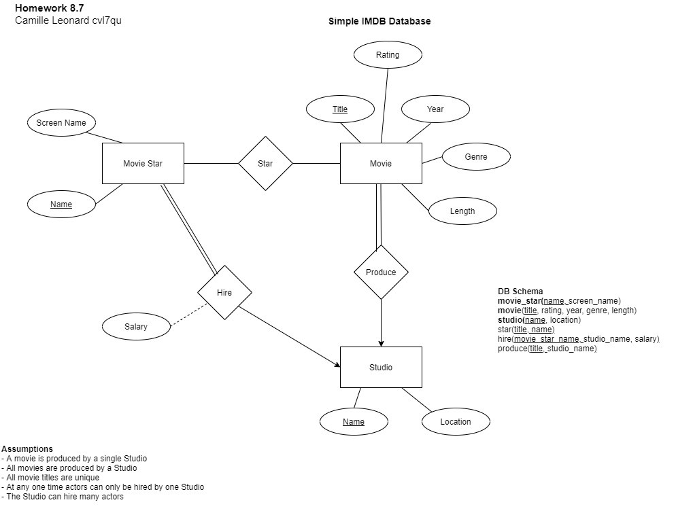
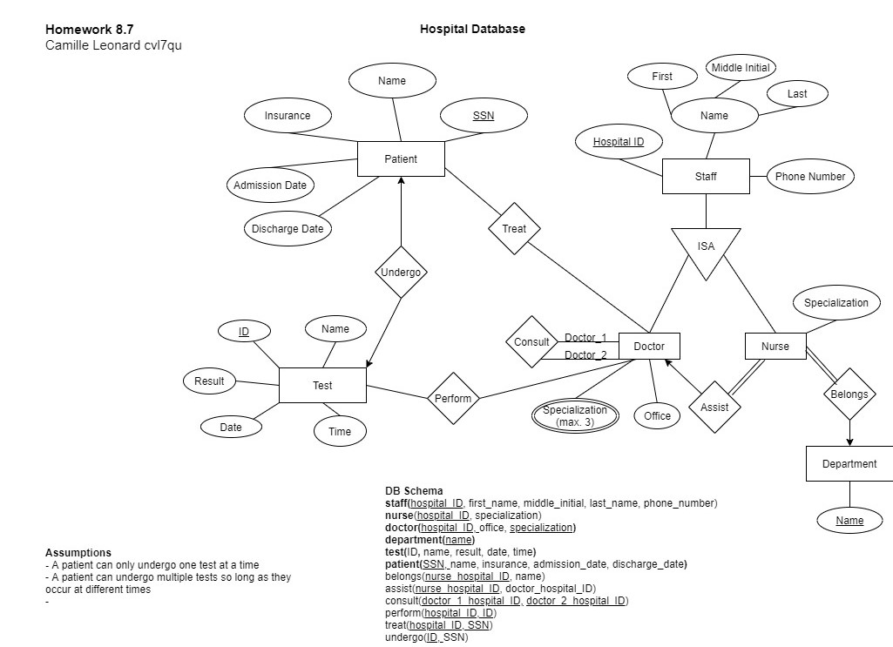

The CS 5012 curriculum included learning to read and build Entity Relationship (ER) diagrams and schemas. The following were the assignment prompts and my submissions. 

 

**Create an ER diagram for the following database scenario. Make sure to include an indication of the cardinality of relationships and indicate any mandatory relationships (total participation). State any assumptions that you make!**

**Convert Task 1's ER diagram to a DB Schema (table names and attributes with primary key).** 

Simple IMDB Database

* Movie stars obviously have names (real and screen in some cases).
* Movie stars star in movies.
* Movies have titles, the year they came out, a genre, a length, and a rating.
* A rating can be G, PG, PG-13, or R.
* Movies are produced by studios.
* There are various different studios around the world.
* Movie studios hire actors to be in their movies and pay them a great deal of money (salary).

 

 

**Create an ER diagram for the following database scenario. Make sure to include an indication of the cardinality of relationships and indicate any mandatory relationships (total participation). State any assumptions that you make! **

**Convert Task 3's ER diagram to a DB Schema (table names and attributes with primary key).** 

Hospital Database

* Hospital staff consists of doctors and nurses.
* All hospital staff have a hospital ID, name (first name, middle initial, and last name), and phone number.
* Doctors have an office and up to three specializations.
* Doctors have nurses that work with/assist them.
* Nurses have one specialization and belong to a specific department in the hospital.
* All nurses work with doctors (no exception). Many nurses can work with one doctor.
* Doctors sometimes consult with a colleague (who is another doctor).
* Doctors treat patients.
* Patient information is collected by the hospital and includes SS# (social security number), name, insurance, date of admission, and date checked out.
* A patient can undergo a number of tests.
* Doctors perform tests.
* Tests have a unique ID, name, a result, and a date and time the test was performed.

 

