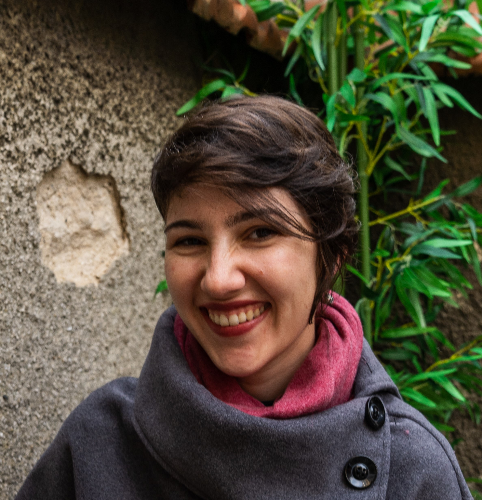

--- 
title: "About Me"
output:
  html_document:
    #css: style.css
    theme: spacelab
---

{width=200px}

Originally from the Tampa Bay area, I got a B.S. degree from the University of Florida in Material Science Engineering. I've worked as a Metallurgical Engineer for the last 4.5 years in Roanoke, VA. 

In May, I started a part-time, online Data Science M.S. degree offered by the University of Virginia. You can find examples of my semester projects, both group and individual, [here](github.com/camillevleonard).

When I have a little bit of time between working full time and getting the Master's, I like to read, play D&D, take photos, travel, and skate or bike.  