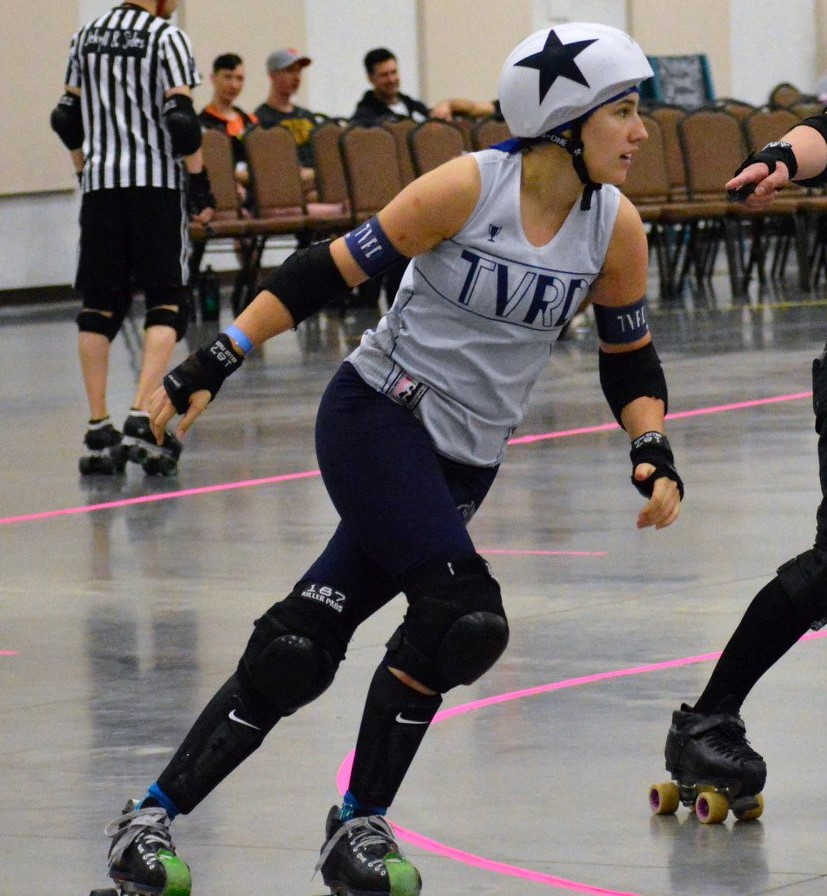
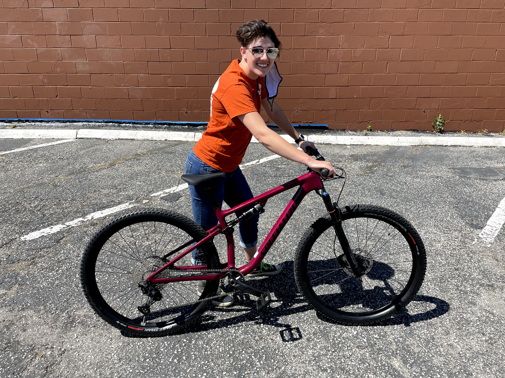

--- 
title: "About Me"
output:
  html_document:
    #css: bootstrap.css
    theme: yeti
---

{width=300px} 

Hello, my name is Camille! I'm originally from the Tampa Bay area and was awarded a B.S. degree from the University of Florida in Material Science Engineering in 2016. I've worked as a Metallurgical Engineer for the last 5 years in Roanoke, VA. 

Since May 2020, I've been expanding my skillsets to include data analysis, visualization, and modeling though the part-time, online Data Science M.S. degree offered by the University of Virginia. I find data wrangling and visualization to be interesting puzzles. 

{width=300px align="right"} 

 

 

 

 

 

 
 
 
 
 
 
 
 

I enjoy being active, which before the pandemic involved playing as a jammer for my local roller derby team. Since the pandemic, I've shifted to cycling and even mountain biking. Rolling down a mountain approximates the thrill of being lead jammer lapping your opponent. 

{width=400 align="left"}
 

 

 

 

 

 

 
 
  
 
 
 

Beyond being active, I'm also involved in my community and have been the Secretary of the local League of Women Voters chapter since 2017. Our efforts have helped to educate and register voters in the Roanoke area. 

You can find examples of my projects, both group and individual, [here](https://camillevleonard.github.io/index.html).