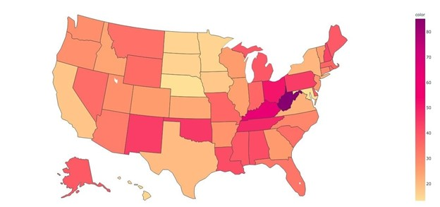

--- 
title: "Camille V. Leonard"
output:
  html_document:
    theme: yeti
---

$~$

### Welcome to my website!

I'm currently completing a MS in Data Science through UVA's part-time online program. I'm incredibly excited to be learning something new and love digging into the data. 

Below I have listed my UVA MSDS coursework, personal projects, and additional independent learning. To view project write-ups and code please visit the included links. I'm most proud of my final project from the Data Mining class. Check it out if you have a few minutes!

  

## **Summer 2021**

### Exploratory Text Analytics (DS 5001)

*Course Description:* This course provides an introduction to text analytics with a focus on pattern discovery in long-form documents, such as reviews, news articles, and novels. Students convert source texts into structure-preserving analytical form and then apply information theory, NLP tools, and vector-based methods to explore language models, topic models, sentiment analyses, and narrative structures. The focus is on unsupervised methods to explore cognitive and social patterns in texts. Code work employs the Python stack, including NumPy, Pandas, SciKit Learn, NLTK, and other packages.

  

### Big Data Systems 

*Course Description:* Increasingly, data scientists and data engineers are working with datasets that exceed the memory of a single machine. This motivates the need for a different paradigm of computing and a different toolset. This course will prepare you for this use case.

The focus of the course is learning Spark, an open-source, general-purpose computing framework that is scalable and blazingly fast. The fundamental data types and concepts will be covered (e.g., resilient distributed datasets, DataFrames). You will learn how to use Spark for large-scale analytics and machine learning, among other topics. Tools for data storage and retrieval will be covered, including AWS and the Hadoop ecosystem.

A team project is a large component of the course, whereby you will conduct an end-to-end data science project. This simulates the workflow of a professional data scientist, from developing a hypothesis to communicating with stakeholders.

After completing this course, you will have developed valuable data science skills and experience working with big data frameworks.

 

## **Spring 2021**

### Foundations of Computer Science (CS 5012)

*Course Description:* The main goal of this course is to provide an overview of fundamental computer science concepts, such as algorithm design, data structures, databases and analysis techniques. To reach this goal, topics include: algorithms for hash tables, trees, queues, sorting, graphs; key-value stores at scale; database topics such as RA, ER, and the MySQL language; and finally some advanced analysis techniques. 

{width=400}

[Mini SQL Project: Kepler Telescope Data](CS_5012_Mini_Project.html)

*Project Description:* A data set was selected in order to create a SQLite database containing 3-4 tables. The database was then queried to create data frames that were used to create visualizations. 

{width=600}

[Creating ER Diagram Practice](CS_5012_ER_Diagram.html)

 

## **Fall 2020**

### Data Mining (SYS 6018)

*Course Description:* Data mining describes approaches to turning data into information. Rather than the more typical deductive strategy of building models using known principles, data mining uses inductive approaches to discover the appropriate models. These models describe a relationship between a system’s response and a set of factors or predictor variables. Data mining in this context provides a formal basis for machine learning and knowledge discovery. This course investigates the construction of empirical models from data mining for systems with both discrete and continuous valued responses. It covers both estimation and classification, and explores both practical and theoretical aspects of data mining.

{width=500}

[Final Project: Haitain Earthquake Disaster Response](2020-11-22-haitian-blue-tarp/project.html)

*Project Description:* Predicted the presence of blue tarps from disaster relief data using data modeling techniques (logistic regression, LDA, QDA, KNN, SVM, and random forest).  

 

## **Summer 2020**

### Linear Models for Data Science (STAT 6021)

*Course Description:* An introduction to linear statistical models in the context of data science. Topics include simple and multiple linear regression, generalized linear models, time series, analysis of covariance, tree-based classification, and principal components. The primary software is R. 

{height=400}

[Final Project: Tip Analysis of Chicago Transportation Network Company Trips](https://github.com/camillevleonard/STAT6021_FinalProject)

*Project Description* Predicted whether a driver would receive a tip using logistic regression applied to the City of Chicago’s Transportation Networking Companies (TNC) “Trips” data set. 

 

### Programming and Systems for Data Science (CS 5010)

*Course Description:* The objective of this course is to introduce basic data analysis techniques including data analysis at scale, in the context of real-world domains such as bioinformatics, public health, marketing, security, etc. For the purpose of facilitating data manipulation and analysis, students will be introduced to essential programming techniques in Python, an increasingly prominent language for data science and “big data” manipulation.

[Final Project: Drug Awareness Response Tool (DART)](https://github.com/camillevleonard/CS5010_FinalProject) 

*Project Description:* This project aims to develop knowledge and insight into the drug epidemic in the US between the years 2000-2017 using data accumulated by IHME through various governmental sources, including the CDC. The python module is intended to be flexible, allowing queries for all states, one state, all years in the time period, or even one year. The output is tabular in some cases and graphical in other cases. We intend the user to be at least familiar with python coding, data manipulation, and data visualization. The queries are robust, however, and do not require modifications for most basic queries.

 

## **Additional Learning**

* [How Git Works](https://www.pluralsight.com/courses/how-git-works) 

 
 

This website is created from Rmd files hosted on Github based on [this tutorial](http://nickstrayer.me/RMarkdown_Sites_tutorial/) by Nick Strayer. 